# 超市库存管理系统毕业设计项目书

> 文档版本：V2.1  
> 编制日期：2026-03-20（Asia/Shanghai）  
> 文档性质：本科毕业设计项目书  
> 适用对象：导师评审、毕业设计答辩、项目开发实施

## 执行摘要

本项目建设一套面向超市场景的库存管理系统，围绕“商品、库存、入库、出库、盘点、报表、系统管理”的业务闭环开展设计与实现。系统采用前后端分离架构，前端使用 Vue 3，后端使用 Spring Boot，数据库使用 MySQL 8.0.44，Redis 作为可选缓存组件，最终部署于华为云服务器。

本系统的核心设计思想是“统一库存控制”。`stock` 模块作为唯一允许直接修改库存数据的核心模块，`inbound`、`outbound`、`stockcheck` 三个模块负责记录库存变化原因，并统一调用库存模块完成库存增减与调整，从而保证库存数据的一致性、可追溯性和系统结构的清晰性。

当前数据库已经按照 [market.sql](E:\InventoryManagementSystem\Document\3-项目开发\market.sql) 建立完成，因此本项目书中所有数据库设计、数据表概要、接口示例与业务流程均以现有数据库结构为准，不再保留“建议型数据库设计”表述。

---

## 一、项目概述

### 1.1 项目背景

超市日常经营过程中存在大量商品入库、出库和盘点操作，库存数据变化频繁。若仍采用人工记录或分散管理方式，容易出现库存不准确、记录不一致、业务难追溯等问题。为解决这些问题，本课题设计并实现一套超市库存管理系统，对库存相关业务进行集中化、规范化管理。

### 1.2 项目目标

本项目的目标如下：

- 实现商品、库存、入库、出库、盘点等核心业务的信息化管理
- 建立统一库存控制机制，保证库存数据一致性
- 支持用户认证、角色管理和系统访问控制
- 提供库存统计、入库统计、出库统计等报表功能
- 形成一套适合本科毕业设计展示与答辩的完整系统方案

### 1.3 项目范围

本项目范围内包括以下 9 个功能模块：

- `auth`：认证与权限模块
- `user`：用户管理模块
- `product`：商品管理模块
- `stock`：库存管理模块
- `inbound`：入库管理模块
- `outbound`：出库管理模块
- `stockcheck`：库存盘点模块
- `report`：报表统计模块
- `system`：系统管理模块

范围外内容如下：

- 多仓库库存管理
- POS 收银系统对接
- 移动端 App
- 财务对账
- 复杂审批流

可选扩展内容如下：

- `purchase` 采购模块
- 供应商管理

### 1.4 项目交付物

- 毕业设计项目书
- 需求分析与系统设计文档
- 数据库脚本与数据库说明
- 前后端源代码
- 接口文档
- 测试说明与测试结果
- 系统部署文档
- 毕业论文撰写所需的系统设计依据

---

## 二、需求说明

### 2.1 功能需求

#### 2.1.1 auth 认证与权限模块

主要功能如下：

- 用户登录
- 用户登出
- 基于 Token 的身份认证
- 访问接口时的权限校验

边界如下：

- 不处理库存业务
- 不直接修改商品、库存、单据等业务数据

#### 2.1.2 user 用户管理模块

主要功能如下：

- 用户新增、修改、删除、查询
- 用户状态管理，包括启用与禁用
- 用户角色分配与维护

边界如下：

- 只维护用户与角色关系
- 不直接参与入库、出库、盘点等业务流程

#### 2.1.3 product 商品管理模块

主要功能如下：

- 商品基础信息维护
- 商品状态管理
- 商品查询

边界如下：

- 只描述商品属性
- 不负责库存数量维护

#### 2.1.4 stock 库存管理模块

主要功能如下：

- 当前库存数量维护
- 库存上下限维护
- 库存合法性校验
- 库存变更日志记录
- 库存查询

边界如下：

- 是唯一允许直接修改库存表的模块
- 入库、出库、盘点只能通过该模块修改库存

#### 2.1.5 inbound 入库管理模块

主要功能如下：

- 新增入库记录
- 查询入库记录
- 记录入库商品、数量、操作人、时间
- 调用库存模块增加库存

边界如下：

- 不允许直接修改库存表

#### 2.1.6 outbound 出库管理模块

主要功能如下：

- 新增出库记录
- 查询出库记录
- 记录出库商品、数量、操作人、时间
- 调用库存模块减少库存

边界如下：

- 不允许直接修改库存表
- 库存不足时必须拒绝出库

#### 2.1.7 stockcheck 库存盘点模块

主要功能如下：

- 记录系统库存与实际库存
- 计算库存差异
- 保存盘点记录
- 调用库存模块执行库存调整

边界如下：

- 负责发现差异
- 不允许直接修改库存表

#### 2.1.8 report 报表统计模块

主要功能如下：

- 库存统计
- 入库统计
- 出库统计
- 库存变化趋势展示
- 库存预警统计

边界如下：

- 仅允许查询
- 不修改任何业务数据

#### 2.1.9 system 系统管理模块

主要功能如下：

- 系统基础配置展示
- 操作说明与基础管理功能
- 系统运行辅助信息展示

说明如下：

- 由于当前数据库中未单独设计 `operation_log` 和 `system_config` 表，因此本毕业设计中的 system 模块以系统页面展示、运行说明、账号管理入口、日志文件查看说明等轻量化功能为主

### 2.2 非功能需求

#### 2.2.1 性能需求

- 普通查询操作响应时间应控制在 3 秒以内
- 常用列表查询与详情查询应尽量保持快速响应
- 入库、出库、盘点等写操作应保证事务一致性

#### 2.2.2 安全需求

- 用户登录后方可访问受保护资源
- 不同角色应具有不同访问权限
- 用户密码不得明文展示或明文存储，应仅保存密码哈希摘要
- 当前阶段密码存储正式采用 `BCrypt` 哈希方案，后续如有更高安全需求可升级为 `Argon2id`
- 前端提交用户输入的原始密码时，认证链路必须运行在 `HTTPS` 之上；后端仅保存密码哈希摘要并进行安全匹配
- 核心操作应具备可追溯性

#### 2.2.3 可维护性需求

- 系统应采用清晰的模块划分
- 前后端分离，便于后续维护
- 库存规则集中在库存模块中，便于统一修改

#### 2.2.4 可扩展性需求

- 后续若新增库存变化业务，可继续扩展新的“原因模块”
- 系统结构应支持功能模块扩展

---

## 三、总体架构与技术选型

### 3.1 系统总体架构

本系统采用前后端分离架构，整体由浏览器、Nginx、Vue 3 前端、Spring Boot 后端、MySQL 数据库组成，Redis 作为可选组件。

系统调用链如下：

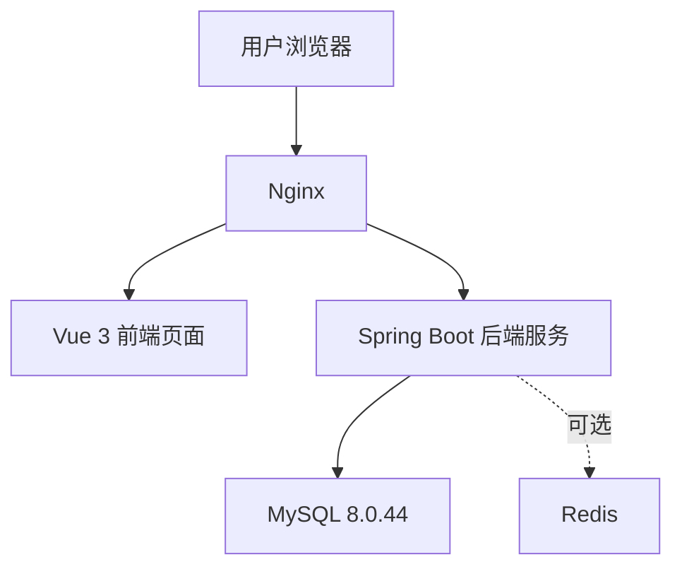

### 3.2 技术选型确定

本项目的技术选型确定如下：

| 层次 | 选型 | 说明 |
|---|---|---|
| 前端 | Vue 3 | 用于实现管理端页面，适合后台管理系统开发 |
| 前端语言 | JavaScript / 可逐步引入 TypeScript | 毕设阶段优先保证功能实现 |
| 前端运行环境 | Node.js 24.14.0 | 用于前端依赖安装、开发调试与打包 |
| 后端 | Spring Boot | 用于构建 RESTful API，结构清晰、资料丰富 |
| 数据库 | MySQL 8.0.44 | 已完成建库建表，作为正式数据库方案 |
| 缓存 | Redis（可选） | 主要用于 Token、热点数据缓存，不作为强依赖 |
| Web 服务器 | Nginx | 用于部署前端静态资源并反向代理后端接口 |
| 服务器环境 | 华为云 ECS 云服务器 | 作为系统运行环境 |
| 操作系统 | Ubuntu 22.04 LTS | 稳定、资料丰富，适合部署 Java、Nginx、MySQL |
| JDK | JDK 21 | 长期支持版本，适合当前 Spring Boot 项目开发与部署 |
| 构建工具 | Maven 3.9.14 | 用于后端依赖管理、构建与打包 |

### 3.3 技术选型说明

#### 前端采用 Vue 3

原因如下：

- 适合构建后台管理系统
- 组件化开发方式清晰
- 学习成本适中，便于毕业设计展示

#### 后端采用 Spring Boot

原因如下：

- 适合快速搭建 REST API
- 分层架构清晰，便于体现软件工程思想
- 与用户、商品、库存、单据等模块化设计契合

#### 数据库采用 MySQL 8.0.44

原因如下：

- 关系型数据库适合本系统的业务模型
- 已依据 [market.sql](E:\InventoryManagementSystem\Document\3-项目开发\market.sql) 完成建表
- 支持约束、索引、事务，能够满足库存业务一致性要求

#### Redis 作为可选组件

使用方式如下：

- 可用于存储登录 Token
- 可用于缓存热点查询结果
- 若毕业设计时间有限，可先不启用，不影响主系统运行

### 3.4 后端分层架构

后端采用如下分层：

- `Controller`：接收请求、参数校验、返回统一结果
- `Service`：业务流程编排与事务控制
- `Domain`：核心业务规则封装，重点体现在库存模块
- `Repository/Mapper`：数据库读写

核心分层调用关系如下：

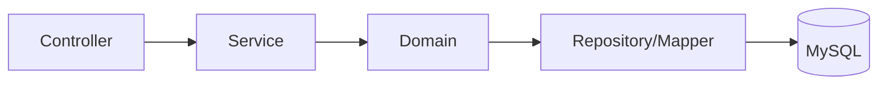

---

## 四、项目结构设计

### 4.1 结构设计目标

为了便于毕业设计开发、联调、部署与后续论文撰写，本项目在结构设计上遵循“清晰、够用、不过度设计”的原则。

结构设计目标如下：

- 前后端分离，便于独立开发与部署
- 按业务模块划分代码，便于理解与维护
- 后端采用统一分层，但不过度引入复杂架构
- 重点突出库存模块的核心地位
- 结构与当前项目书功能范围、数据库设计保持一致

### 4.2 现有后端包结构初稿分析

根据 [系统架构设计.md](E:\InventoryManagementSystem\Document\2-系统设计\系统架构设计.md) 中的后端包结构初稿，整体思路是“按业务模块拆分 + 模块内部分层”，这个方向是正确的，适合作为库存管理系统的基础结构。

但目前初稿存在以下几个问题：

#### 4.2.1 存在超出当前核心范围的模块

初稿中包含 `purchase` 模块。考虑到你当前毕业设计的核心目标仍然是库存管理主线，因此不建议把 `purchase` 作为本次必须完成的正式核心模块；更合适的处理方式是将其保留为可选扩展项，而不纳入默认的正式项目结构与开发主线。

#### 4.2.2 各模块内部结构不统一

例如：

- `user`、`product`、`stock` 模块下包含 `entity`、`dto`、`vo`、`enum`
- `auth`、`inbound`、`outbound`、`stockcheck`、`system` 模块下却没有统一展示这些层次

这种写法会导致后续编码时风格不一致，不利于项目维护。

#### 4.2.3 Domain 层使用可以简化

对于本科毕业设计来说，不需要每个模块都做非常完整的 DDD 风格拆分。更合适的做法是：

- 大多数模块采用 `controller + service + mapper + entity + dto + vo`
- 仅在 `stock` 模块中单独强调库存领域服务，用于统一库存变更逻辑

这样既能体现设计思想，又不会让项目结构变得过重。

#### 4.2.4 system 模块不宜设计过重

当前数据库中没有单独的 `system_config`、`operation_log` 等表，因此 `system` 模块不适合设计成复杂的“配置中心”或“审计中心”。在毕业设计里更适合将其作为轻量化系统信息与辅助管理模块。

#### 4.2.5 application 目录表达不够直观

初稿中把启动类放在 `application` 目录下虽然可行，但对毕业设计而言，更直观的写法是：

- 启动类放在根包下
- `config` 单独放在公共配置目录中

这样结构更常见，也更利于答辩时说明。

### 4.3 推荐的整体项目目录结构

本项目建议采用前后端分离的双项目结构，目录组织如下：

```text
InventoryManagementSystem
├─ Document/                         文档资料
├─ frontend/                         Vue 3 前端项目
├─ backend/                          Spring Boot 后端项目
├─ sql/                              数据库脚本
└─ README.md                         项目说明
```

说明如下：

- `Document/` 用于保存需求分析、系统设计、项目书等文档
- `frontend/` 用于前端页面开发
- `backend/` 用于后端接口与业务逻辑开发
- `sql/` 用于存放正式数据库脚本，可放置 `market.sql`

### 4.4 前端项目结构设计

前端采用 Vue 3，结构应以“页面、组件、接口、路由、状态管理”划分为主，不需要过度复杂。

推荐前端目录结构如下：

```text
frontend
├─ public/
├─ src/
│  ├─ api/                    接口请求封装
│  ├─ assets/                 图片、样式等静态资源
│  ├─ components/             公共组件
│  ├─ layout/                 后台整体布局
│  ├─ router/                 路由配置
│  ├─ stores/                 状态管理
│  ├─ utils/                  工具函数
│  ├─ views/                  页面模块
│  │  ├─ login/               登录页
│  │  ├─ user/                用户管理页
│  │  ├─ product/             商品管理页
│  │  ├─ stock/               库存管理页
│  │  ├─ inbound/             入库管理页
│  │  ├─ outbound/            出库管理页
│  │  ├─ stockcheck/          盘点管理页
│  │  ├─ report/              报表页
│  │  └─ system/              系统信息页
│  ├─ App.vue
│  └─ main.js
├─ package.json
└─ vite.config.js
```

#### 4.4.1 前端结构说明

- `api`：封装各模块接口请求，如用户、商品、库存、入库、出库等
- `components`：存放表格、弹窗、分页等公共组件
- `layout`：存放侧边栏、顶部栏、主内容区等后台布局
- `router`：统一配置页面路由与权限路由
- `stores`：存储用户登录状态、Token、菜单状态等
- `views`：按业务模块划分页面，便于与后端模块一一对应

#### 4.4.2 前端 views 页面划分建议

每个业务页面目录下可继续按“列表页 + 表单页 + 明细弹窗”组织，例如：

```text
views/product
├─ ProductList.vue
├─ ProductForm.vue
└─ ProductDetail.vue
```

这种结构简单、清晰，适合毕业设计实现。

### 4.5 后端项目结构设计

后端采用 Spring Boot，建议使用“按业务模块拆分 + 模块内统一分层”的结构方式。

推荐后端目录结构如下：

```text
backend
├─ src/main/java/com/supermarket/inventory
│  ├─ InventoryApplication.java
│  ├─ config/
│  ├─ common/
│  │  ├─ exception/
│  │  ├─ response/
│  │  ├─ util/
│  │  └─ constant/
│  ├─ auth/
│  ├─ user/
│  ├─ product/
│  ├─ stock/
│  ├─ inbound/
│  ├─ outbound/
│  ├─ stockcheck/
│  ├─ report/
│  └─ system/
│
├─ src/main/resources/
│  ├─ application.yml
│  ├─ application-dev.yml
│  ├─ application-prod.yml
│  ├─ mapper/
│  └─ static/
│
└─ pom.xml
```

### 4.6 后端业务模块内部结构设计

对于大多数业务模块，建议采用如下统一结构：

```text
module-name
├─ controller/
├─ service/
├─ mapper/
├─ entity/
├─ dto/
├─ vo/
└─ enums/
```

各层职责如下：

- `controller`：接收 HTTP 请求，返回统一响应
- `service`：处理业务逻辑与事务
- `mapper`：数据库访问层
- `entity`：与数据库表对应的实体类
- `dto`：前端请求参数对象
- `vo`：返回给前端的结果对象
- `enums`：状态、类型等枚举定义

### 4.7 推荐的后端包结构设计

结合当前项目书功能范围，推荐的后端包结构如下：

```text
com.supermarket.inventory
├─ InventoryApplication.java
├─ config
│  ├─ CorsConfig.java
│  ├─ MybatisConfig.java
│  ├─ SecurityConfig.java
│  └─ WebMvcConfig.java
│
├─ common
│  ├─ constant
│  ├─ exception
│  ├─ response
│  └─ util
│
├─ auth
│  ├─ controller
│  ├─ service
│  ├─ password
│  ├─ dto
│  └─ vo
│
├─ user
│  ├─ controller
│  ├─ service
│  ├─ mapper
│  ├─ entity
│  ├─ dto
│  ├─ vo
│  └─ enums
│
├─ product
│  ├─ controller
│  ├─ service
│  ├─ mapper
│  ├─ entity
│  ├─ dto
│  ├─ vo
│  └─ enums
│
├─ stock
│  ├─ controller
│  ├─ service
│  ├─ domain
│  ├─ mapper
│  ├─ entity
│  ├─ dto
│  ├─ vo
│  └─ enums
│
├─ inbound
│  ├─ controller
│  ├─ service
│  ├─ mapper
│  ├─ entity
│  ├─ dto
│  ├─ vo
│  └─ enums
│
├─ outbound
│  ├─ controller
│  ├─ service
│  ├─ mapper
│  ├─ entity
│  ├─ dto
│  ├─ vo
│  └─ enums
│
├─ stockcheck
│  ├─ controller
│  ├─ service
│  ├─ mapper
│  ├─ entity
│  ├─ dto
│  ├─ vo
│  └─ enums
│
├─ report
│  ├─ controller
│  ├─ service
│  ├─ mapper
│  ├─ dto
│  └─ vo
│
└─ system
   ├─ controller
   ├─ service
   ├─ dto
   └─ vo
```

### 4.8 后端结构设计说明

#### 4.8.1 为什么不将 purchase 纳入默认正式结构

当前毕业设计的主线仍然是库存管理闭环，因此 `purchase` 与供应商管理更适合作为可选扩展项保留，而不是纳入默认正式项目结构。这样既能保证项目主线清晰，也为后续扩展预留空间。

#### 4.8.2 为什么只在 stock 模块保留 domain

库存模块是系统核心模块，承担统一库存变更控制职责，因此有必要通过 `domain` 层单独封装库存变更规则。

而其他模块主要承担业务记录与流程编排职责，使用 `service` 层即可，不需要全部做重领域建模。

#### 4.8.3 为什么 report 模块不需要 entity

报表模块主要进行多表查询与统计汇总，很多情况下直接返回统计结果即可，因此可以只保留 `dto`、`vo`、`mapper` 和 `service`，不一定需要复杂实体层。

#### 4.8.4 为什么 system 模块结构更轻

当前数据库没有独立的 system 业务表，因此 system 模块以“系统信息展示、运行说明、辅助管理入口”为主，不需要像用户、商品、库存模块那样设计完整持久化层。

#### 4.8.5 为什么在 auth 模块中统一封装 PasswordEncoder

密码编码与校验属于认证基础能力，适合在 `auth` 模块中通过统一的 `PasswordEncoder` 或密码服务进行封装，而不是分散在用户新增、重置密码、登录校验等多个业务点中直接实现。

推荐设计如下：

- 对上层暴露统一的密码服务接口，例如 `PasswordService`
- 对下层封装具体密码编码器，例如 `PasswordEncoder`
- 当前实现阶段底层采用 `BCrypt`
- 后续若升级为 `Argon2id`，应尽量保持上层调用接口不变，仅替换底层实现或调整统一配置

这样可以带来以下好处：

- 避免密码逻辑散落在多个模块中
- 保证新增、重置、登录校验使用同一套规则
- 为后续从 `BCrypt` 平滑升级到 `Argon2id` 预留接口兼容空间

### 4.9 resources 资源目录设计

后端 `resources` 目录建议如下：

```text
src/main/resources
├─ application.yml
├─ application-dev.yml
├─ application-prod.yml
├─ mapper/
│  ├─ UserMapper.xml
│  ├─ ProductMapper.xml
│  ├─ StockMapper.xml
│  ├─ InboundOrderMapper.xml
│  ├─ OutboundOrderMapper.xml
│  ├─ StockCheckMapper.xml
│  └─ StockLogMapper.xml
└─ static/
```

说明如下：

- `application.yml`：公共配置
- `application-dev.yml`：本地开发环境配置
- `application-prod.yml`：服务器部署环境配置
- `mapper/`：MyBatis XML 映射文件

### 4.10 测试目录设计

测试目录建议如下：

```text
src/test/java/com/supermarket/inventory
├─ auth/
├─ user/
├─ product/
├─ stock/
├─ inbound/
├─ outbound/
├─ stockcheck/
└─ report/
```

对于毕业设计来说，测试不需要追求非常复杂，但建议至少覆盖以下核心内容：

- 登录测试
- 用户管理测试
- 商品管理测试
- 库存增减测试
- 出库库存不足测试
- 盘点差异调整测试

### 4.11 项目结构设计小结

综合来看，本项目的最佳结构不是“做成很复杂的大型企业系统”，而是：

- 前端和后端清晰分离
- 后端按模块拆分
- 模块内部统一分层
- 对库存模块适当强化领域设计
- 对 report 和 system 保持轻量化

这种结构既能够体现软件工程与系统设计能力，也适合本科毕业设计在时间和复杂度上的实际要求。

---

## 五、数据库设计

### 4.1 数据库说明

本系统数据库名称为 `supermarket_inventory`，字符集为 `utf8mb4`，排序规则为 `utf8mb4_unicode_ci`。数据库脚本文件为 [market.sql](E:\InventoryManagementSystem\Document\3-项目开发\market.sql)。

本项目书中的数据库设计以已建成数据库为准，不再采用“建议型”表结构。

### 4.2 数据库表清单

当前数据库共包含以下 9 张核心数据表：

- `user`
- `role`
- `user_role`
- `product`
- `stock`
- `inbound_order`
- `outbound_order`
- `stock_check`
- `stock_log`

### 4.3 数据库 E-R 关系图

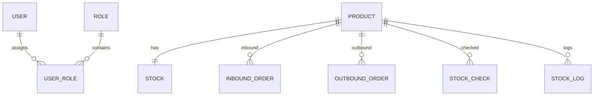

### 4.4 主要数据表设计

#### 4.4.1 user 用户表

| 字段名 | 类型 | 约束 | 说明 |
|---|---|---|---|
| id | BIGINT | PK, AUTO_INCREMENT | 用户主键 |
| username | VARCHAR(50) | NOT NULL, UNIQUE | 登录账号 |
| password | VARCHAR(255) | NOT NULL | 密码哈希摘要，不存储明文密码 |
| real_name | VARCHAR(50) |  | 真实姓名 |
| status | TINYINT | NOT NULL, DEFAULT 1 | 0-禁用，1-启用 |
| create_time | DATETIME | NOT NULL | 创建时间 |

密码字段说明如下：

- `password` 字段应保存经过哈希算法处理后的密码摘要，而不是用户原始密码
- 当前阶段正式采用 `BCrypt` 保存密码哈希摘要
- 后续若需要进一步提升抗 GPU 暴力破解能力，可将方案升级为 `Argon2id`
- 为兼容不同哈希算法的编码结果以及后续算法升级，字段长度建议使用 `VARCHAR(255)`

#### 4.4.2 role 角色表

| 字段名 | 类型 | 约束 | 说明 |
|---|---|---|---|
| id | BIGINT | PK, AUTO_INCREMENT | 角色主键 |
| role_name | VARCHAR(50) | NOT NULL, UNIQUE | 角色名称 |
| role_code | VARCHAR(50) | NOT NULL, UNIQUE | 角色编码 |
| remark | VARCHAR(100) |  | 备注 |
| create_time | DATETIME | NOT NULL | 创建时间 |

#### 4.4.3 user_role 用户角色关联表

| 字段名 | 类型 | 约束 | 说明 |
|---|---|---|---|
| id | BIGINT | PK, AUTO_INCREMENT | 主键 |
| user_id | BIGINT | NOT NULL, FK | 用户 ID |
| role_id | BIGINT | NOT NULL, FK | 角色 ID |

#### 4.4.4 product 商品表

| 字段名 | 类型 | 约束 | 说明 |
|---|---|---|---|
| id | BIGINT | PK, AUTO_INCREMENT | 商品主键 |
| product_code | VARCHAR(50) | NOT NULL, UNIQUE | 商品编号 |
| product_name | VARCHAR(100) | NOT NULL | 商品名称 |
| category | VARCHAR(50) | NOT NULL | 商品分类 |
| purchase_price | DECIMAL(10,2) | NOT NULL | 商品进价 |
| sale_price | DECIMAL(10,2) | NOT NULL | 商品售价 |
| status | TINYINT | NOT NULL, DEFAULT 1 | 0-下架，1-上架 |
| create_time | DATETIME | NOT NULL | 创建时间 |

#### 4.4.5 stock 库存表

| 字段名 | 类型 | 约束 | 说明 |
|---|---|---|---|
| id | BIGINT | PK, AUTO_INCREMENT | 库存主键 |
| product_id | BIGINT | NOT NULL, UNIQUE, FK | 商品 ID |
| quantity | INT | NOT NULL | 当前库存数量 |
| min_stock | INT | NOT NULL | 库存下限 |
| max_stock | INT | NOT NULL | 库存上限 |
| update_time | DATETIME | NOT NULL | 更新时间 |

#### 4.4.6 inbound_order 入库表

| 字段名 | 类型 | 约束 | 说明 |
|---|---|---|---|
| id | BIGINT | PK, AUTO_INCREMENT | 入库记录主键 |
| product_id | BIGINT | NOT NULL, FK | 商品 ID |
| quantity | INT | NOT NULL | 入库数量 |
| operator | VARCHAR(50) | NOT NULL | 操作人 |
| create_time | DATETIME | NOT NULL | 入库时间 |

#### 4.4.7 outbound_order 出库表

| 字段名 | 类型 | 约束 | 说明 |
|---|---|---|---|
| id | BIGINT | PK, AUTO_INCREMENT | 出库记录主键 |
| product_id | BIGINT | NOT NULL, FK | 商品 ID |
| quantity | INT | NOT NULL | 出库数量 |
| operator | VARCHAR(50) | NOT NULL | 操作人 |
| create_time | DATETIME | NOT NULL | 出库时间 |

#### 4.4.8 stock_check 盘点表

| 字段名 | 类型 | 约束 | 说明 |
|---|---|---|---|
| id | BIGINT | PK, AUTO_INCREMENT | 盘点记录主键 |
| product_id | BIGINT | NOT NULL, FK | 商品 ID |
| system_quantity | INT | NOT NULL | 系统库存 |
| actual_quantity | INT | NOT NULL | 实际库存 |
| difference | INT | NOT NULL | 差异值 |
| check_time | DATETIME | NOT NULL | 盘点时间 |

#### 4.4.9 stock_log 库存日志表

| 字段名 | 类型 | 约束 | 说明 |
|---|---|---|---|
| id | BIGINT | PK, AUTO_INCREMENT | 日志主键 |
| product_id | BIGINT | NOT NULL, FK | 商品 ID |
| change_type | VARCHAR(20) | NOT NULL | INBOUND / OUTBOUND / CHECK |
| change_quantity | INT | NOT NULL | 变化数量 |
| before_quantity | INT | NOT NULL | 变化前库存 |
| after_quantity | INT | NOT NULL | 变化后库存 |
| create_time | DATETIME | NOT NULL | 记录时间 |

### 4.5 数据库设计约束说明

依据 `market.sql`，数据库中已明确以下约束：

- 用户名唯一
- 用户密码应以哈希摘要形式存储，不得保存明文密码
- 当前密码哈希方案采用 `BCrypt`，后续可按统一方案升级为 `Argon2id`
- 前端提交登录密码时，认证链路必须通过 `HTTPS` 传输
- 角色名称唯一
- 角色编码唯一
- 用户与角色组合唯一
- 商品编号唯一
- 商品进价不能小于 0
- 商品售价不能小于 0
- 商品售价不能低于进价
- 库存商品一对一唯一
- 库存数量不能小于 0
- 库存下限不能小于 0
- 库存上限不能小于库存下限
- 入库数量必须大于 0
- 出库数量必须大于 0
- 盘点中的系统库存与实际库存不能小于 0
- 库存日志变化后库存不能小于 0

---

## 六、详细模块设计汇总

### 5.1 模块统一设计原则

系统模块设计遵循以下原则：

- 模块职责清晰
- 库存控制统一
- 原因模块与状态模块解耦
- 报表模块只读
- 基于已建数据库开展接口与业务设计

统一接口前缀确定为：

- `/api`

统一返回结构确定为：

```json
{
  "code": 0,
  "message": "success",
  "data": {}
}
```

### 5.2 auth 模块

#### 模块职责

- 用户登录
- Token 生成与校验
- 用户登出
- 接口访问认证
- 密码哈希校验
- 统一密码编码器或密码服务封装

#### 关联数据表

- `user`
- `role`
- `user_role`

#### API 设计

`POST /api/auth/login`

请求示例：

```json
{
  "username": "admin",
  "password": "123456"
}
```

认证处理说明如下：

- 前端传入的是用户输入的原始密码
- 前端提交原始密码的链路必须建立在 `HTTPS` 之上
- 后端不保存原始密码，只读取数据库中的密码哈希摘要
- 当前登录校验统一通过 `PasswordEncoder` 或密码服务封装调用 `BCrypt` 完成安全匹配
- 后续若系统升级到 `Argon2id`，应保持上层接口不变，通过统一密码编码策略完成迁移与兼容
- 登录响应中不得返回明文密码，也不得返回密码哈希摘要

响应示例：

```json
{
  "code": 0,
  "message": "success",
  "data": {
    "token": "jwt-token",
    "username": "admin",
    "roles": ["ADMIN"]
  }
}
```

认证模块实现建议如下：

- 在 `auth` 模块中统一封装 `PasswordEncoder` 或 `PasswordService`
- 当前底层实现采用 `BCryptPasswordEncoder`
- 后续若升级到 `Argon2id`，优先通过替换统一密码服务底层实现的方式完成升级
- 上层业务代码只依赖统一密码服务接口，不直接依赖具体哈希算法实现

`POST /api/auth/logout`

#### 业务流程图

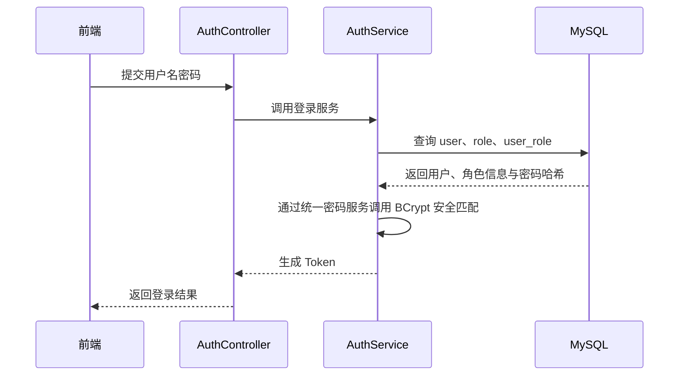

### 5.3 user 模块

#### 模块职责

- 用户新增、修改、删除、查询
- 用户状态管理
- 角色分配
- 新增与重置密码时执行密码哈希处理

#### 关联数据表

- `user`
- `role`
- `user_role`

#### API 设计

`POST /api/users`

```json
{
  "username": "zhangsan",
  "password": "123456",
  "realName": "张三",
  "status": 1,
  "roleIds": [1]
}
```

用户密码处理说明如下：

- 前端提交原始密码时，请求链路必须通过 `HTTPS`
- 用户新增时，后端接收原始密码后先通过统一密码服务使用 `BCrypt` 进行哈希处理，再写入 `user.password`
- 用户重置密码时，同样只保存新的密码哈希摘要，不保存原始密码
- 用户重置密码时，应继续复用同一套 `PasswordEncoder` 或密码服务封装
- 后续如升级为 `Argon2id`，应在统一密码编码策略下完成平滑迁移，并尽量保持上层接口不变
- 用户查询接口不得返回密码字段内容
- 用户新增、查询、修改等接口响应中均不得返回明文密码或密码哈希摘要
- 后台管理页面中不得展示任何可逆的密码信息

`GET /api/users`

`PUT /api/users/{id}`

`DELETE /api/users/{id}`

#### 业务流程图

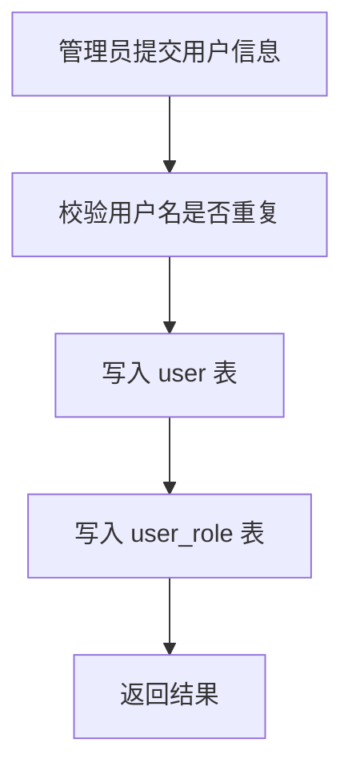

### 5.4 product 模块

#### 模块职责

- 商品新增、修改、删除、查询
- 商品上下架管理

#### 关联数据表

- `product`

#### API 设计

`POST /api/products`

```json
{
  "productCode": "P001",
  "productName": "可口可乐",
  "category": "饮料",
  "purchasePrice": 2.50,
  "salePrice": 3.50,
  "status": 1
}
```

`GET /api/products`

`PUT /api/products/{id}`

`DELETE /api/products/{id}`

#### 业务流程图

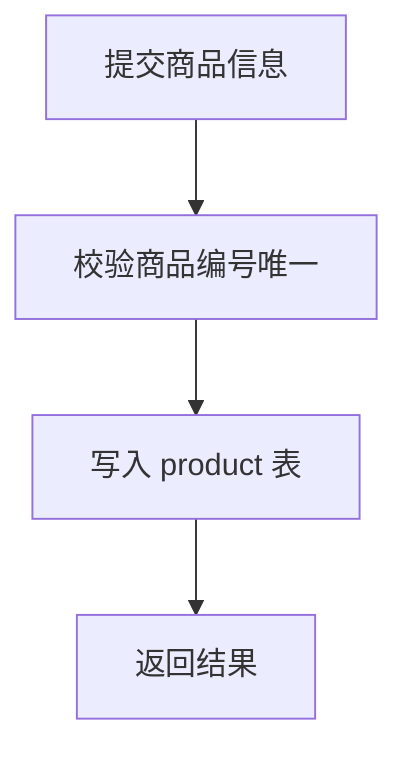

### 5.5 stock 模块

#### 模块职责

- 库存查询
- 库存上下限维护
- 库存变更控制
- 库存日志记录

#### 关联数据表

- `stock`
- `stock_log`

#### API 设计

`GET /api/stocks`

`GET /api/stocks/{productId}`

`PUT /api/stocks/{productId}/limit`

```json
{
  "minStock": 10,
  "maxStock": 200
}
```

#### 业务流程图

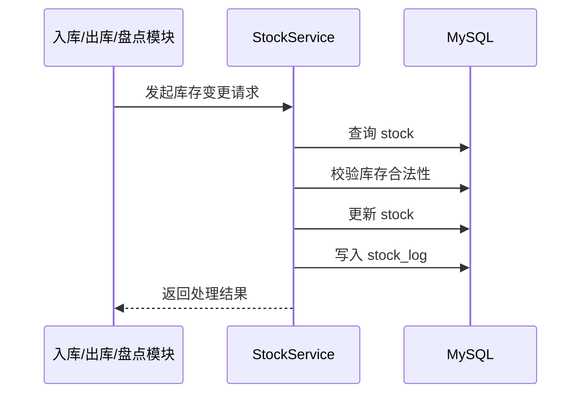

### 5.6 inbound 模块

#### 模块职责

- 记录入库信息
- 增加库存

#### 关联数据表

- `inbound_order`
- `stock`
- `stock_log`

#### API 设计

`POST /api/inbounds`

```json
{
  "productId": 1,
  "quantity": 50,
  "operator": "管理员"
}
```

`GET /api/inbounds`

#### 业务流程图

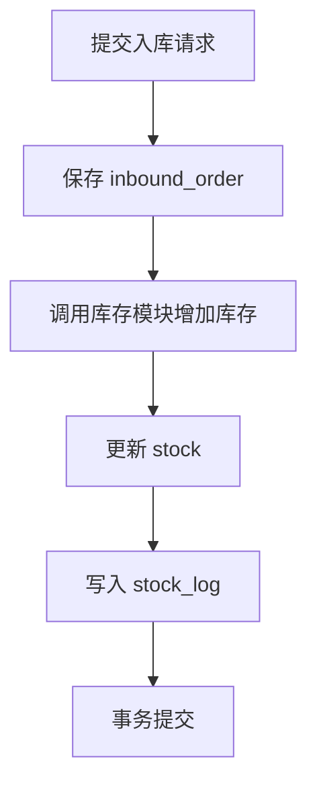

### 5.7 outbound 模块

#### 模块职责

- 记录出库信息
- 减少库存

#### 关联数据表

- `outbound_order`
- `stock`
- `stock_log`

#### API 设计

`POST /api/outbounds`

```json
{
  "productId": 1,
  "quantity": 10,
  "operator": "管理员"
}
```

`GET /api/outbounds`

#### 业务流程图

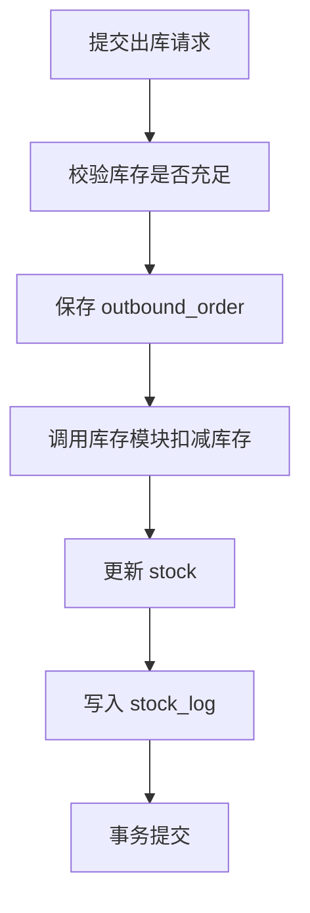

### 5.8 stockcheck 模块

#### 模块职责

- 记录盘点结果
- 计算库存差异
- 调整库存

#### 关联数据表

- `stock_check`
- `stock`
- `stock_log`

#### API 设计

`POST /api/stockchecks`

```json
{
  "productId": 1,
  "actualQuantity": 95
}
```

`GET /api/stockchecks`

#### 业务流程图

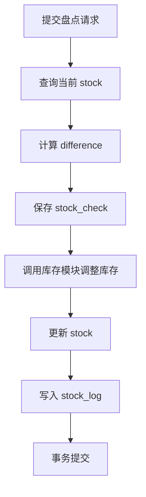

### 5.9 report 模块

#### 模块职责

- 查询并统计库存相关数据
- 提供图表展示数据

#### 关联数据表

- `product`
- `stock`
- `inbound_order`
- `outbound_order`
- `stock_check`

#### API 设计

`GET /api/reports/stock`

`GET /api/reports/inbound`

`GET /api/reports/outbound`

`GET /api/reports/warning`

#### 业务流程图

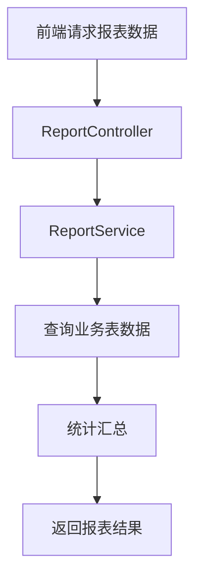

### 5.10 system 模块

#### 模块职责

- 展示系统基础信息
- 提供系统运行说明
- 展示用户、角色与系统入口级管理功能

#### 关联数据

- 当前数据库无独立 system 表
- 该模块主要基于系统配置文件与现有业务数据实现

#### API 设计

`GET /api/system/info`

响应示例：

```json
{
  "code": 0,
  "message": "success",
  "data": {
    "systemName": "超市库存管理系统",
    "version": "1.0.0",
    "database": "MySQL 8.0.44",
    "server": "Huawei Cloud ECS"
  }
}
```

---

## 七、接口设计规范

### 6.1 接口风格

- 所有接口采用 RESTful 风格
- 数据格式统一为 JSON
- 接口统一使用 `/api` 作为前缀

### 6.2 认证方式

- 登录成功后返回 Token
- 前端后续请求通过请求头携带 Token
- Redis 启用时可存储 Token；未启用时可仅由后端内存或 JWT 方式管理

### 6.3 统一状态码

| 状态 | 含义 |
|---|---|
| 0 | 成功 |
| 400 | 请求参数错误 |
| 401 | 未登录或认证失败 |
| 403 | 无权限 |
| 404 | 资源不存在 |
| 500 | 系统内部异常 |

### 6.4 分页规范

列表接口统一支持如下参数：

- `page`
- `pageSize`

返回结构中包含：

- `items`
- `total`
- `page`
- `pageSize`

---

## 八、华为云部署方案设计

### 7.1 部署目标

本系统最终部署于华为云 ECS 云服务器，用于完成毕业设计演示、测试与答辩展示。部署方案以“稳定、简单、可演示”为原则，不追求复杂集群化部署。

### 7.2 推荐部署方案

推荐采用“单台华为云 ECS + Nginx + Spring Boot + MySQL”的部署方案。

推荐配置如下：

| 资源项 | 推荐配置 | 说明 |
|---|---|---|
| 云服务器 | 华为云 ECS | 1 台 |
| CPU / 内存 | 2 核 4GB | 足够支撑毕业设计演示 |
| 系统盘 | 40GB SSD | 用于系统与应用部署 |
| 操作系统 | Ubuntu 22.04 LTS | 便于部署 Java 与 Nginx |
| 公网带宽 | 3Mbps 及以上 | 满足远程访问与答辩演示 |

### 7.3 服务器软件部署组成

服务器上建议部署以下软件：

- Nginx
- JDK 21
- Maven 3.9.14
- Node.js 24.14.0
- MySQL 8.0.44
- Redis（可选）
- Git

部署结构如下：

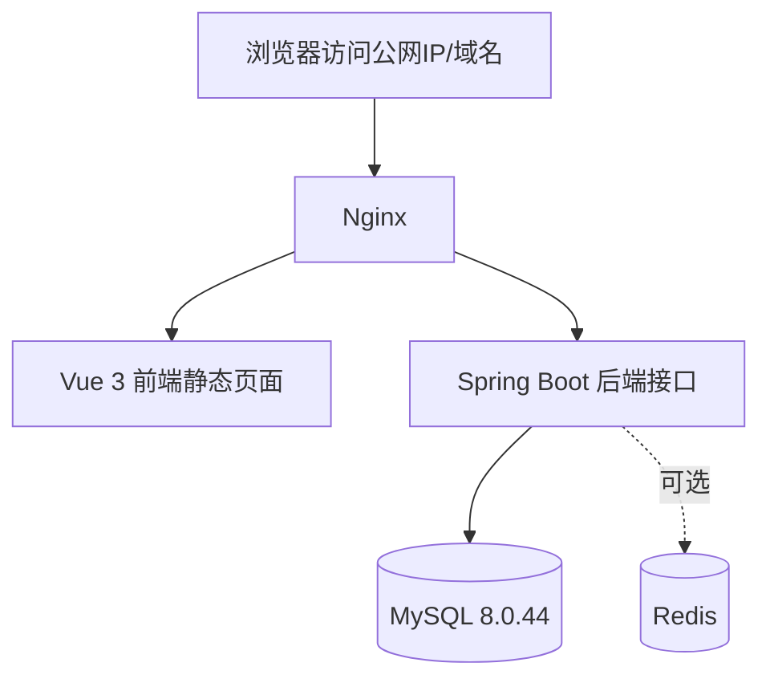

### 7.4 项目部署目录建议

服务器目录建议如下：

```text
/opt/supermarket/
├─ frontend/
│  └─ dist/
├─ backend/
│  └─ supermarket-inventory.jar
├─ logs/
├─ scripts/
└─ backup/
```

### 7.5 前端部署方案

前端 Vue 3 项目部署步骤如下：

1. 在开发环境执行前端打包命令，生成 `dist` 目录
2. 将 `dist` 上传到服务器 `/opt/supermarket/frontend/dist`
3. 配置 Nginx，将静态资源目录指向该路径
4. 通过 Nginx 对外提供前端访问

Nginx 前端配置示例如下：

```nginx
server {
    listen 80;
    server_name _;

    location / {
        root /opt/supermarket/frontend/dist;
        index index.html;
        try_files $uri $uri/ /index.html;
    }

    location /api/ {
        proxy_pass http://127.0.0.1:8080/api/;
        proxy_set_header Host $host;
        proxy_set_header X-Real-IP $remote_addr;
        proxy_set_header X-Forwarded-For $proxy_add_x_forwarded_for;
    }
}
```

### 7.6 后端部署方案

后端 Spring Boot 部署步骤如下：

1. 在本地或服务器通过 Maven 打包生成 Jar
2. 将 Jar 包上传到 `/opt/supermarket/backend/`
3. 配置生产环境 `application-prod.yml`
4. 使用如下命令启动：

```bash
nohup java -jar /opt/supermarket/backend/supermarket-inventory.jar --spring.profiles.active=prod > /opt/supermarket/logs/backend.log 2>&1 &
```

### 7.7 数据库部署方案

数据库部署方式有两种：

#### 方案一：MySQL 部署在同一台 ECS

适用于毕业设计阶段，优点如下：

- 部署简单
- 成本较低
- 演示方便

本项目推荐采用该方案。

#### 方案二：使用华为云 RDS MySQL

适用于后续扩展阶段，优点如下：

- 运维压力更小
- 数据库管理更方便

但对毕业设计而言不是必须。

### 7.8 Redis 部署方案

Redis 为可选项，使用方式如下：

- 若启用，则部署在同一台 ECS 上
- 若不启用，系统仍可正常运行

Redis 主要用途：

- Token 存储
- 热点数据缓存

### 7.9 华为云安全组配置

建议开放如下端口：

| 端口 | 用途 |
|---|---|
| 22 | SSH 远程登录 |
| 80 | HTTP 访问 |
| 443 | HTTPS 访问，可选 |
| 3306 | MySQL，建议仅内网或限制来源 |
| 6379 | Redis，建议不开放公网 |
| 8080 | Spring Boot 服务端口，建议仅本机/Nginx 转发 |

### 7.10 部署实施步骤

完整部署步骤如下：

1. 购买并创建华为云 ECS
2. 安装 Ubuntu 22.04 系统
3. 安装 JDK 21、Maven 3.9.14、Node.js 24.14.0、MySQL 8.0.44、Nginx
4. 导入 `market.sql` 初始化数据库
5. 上传并部署 Spring Boot 后端程序
6. 上传并部署 Vue 3 前端静态文件
7. 配置 Nginx 反向代理
8. 配置华为云安全组
9. 进行功能测试与访问验证

### 7.11 简化运维方案

由于本项目属于本科毕业设计，运维方案采用轻量化设计即可。

建议保留以下基本运维措施：

- 使用 Nginx 访问日志与后端日志定位问题
- 每周手动备份一次 MySQL 数据库
- Jar 包更新前备份旧版本
- 系统异常时通过重启 Nginx、MySQL、Spring Boot 服务进行恢复

数据库备份命令示例如下：

```bash
mysqldump -uroot -p supermarket_inventory > /opt/supermarket/backup/supermarket_inventory.sql
```

### 7.12 可选优化项

若时间允许，可增加以下内容：

- 配置 HTTPS
- 使用 `systemd` 管理 Spring Boot 服务
- 启用 Redis
- 增加自动备份脚本

---

## 九、测试与验收设计

### 8.1 测试内容

测试主要包括：

- 用户登录测试
- 用户与角色管理测试
- 商品管理测试
- 库存查询与库存上下限测试
- 入库功能测试
- 出库功能测试
- 盘点功能测试
- 报表查询测试
- 部署运行测试

### 8.2 核心验收标准

- 用户能够正常登录和退出
- 用户、角色、商品数据能够正常维护
- 入库后库存数量正确增加
- 出库后库存数量正确减少
- 库存不足时出库失败
- 盘点后库存差异能够正确调整
- 库存变化后 `stock_log` 能记录对应日志
- 报表模块能够正确查询统计数据
- 系统能够在华为云服务器上稳定运行

---

## 十、毕业设计实施计划

### 9.1 实施阶段划分

本毕业设计按照以下阶段推进：

| 阶段 | 主要内容 |
|---|---|
| 第一阶段 | 需求分析与文档整理 |
| 第二阶段 | 系统架构与数据库设计确认 |
| 第三阶段 | 后端基础模块开发 |
| 第四阶段 | 库存核心模块开发 |
| 第五阶段 | 入库、出库、盘点模块开发 |
| 第六阶段 | 前端页面开发与联调 |
| 第七阶段 | 报表模块与系统部署 |
| 第八阶段 | 测试、优化与论文整理 |

### 9.2 开发优先级

开发顺序确定如下：

1. `auth`、`user`
2. `product`
3. `stock`
4. `inbound`
5. `outbound`
6. `stockcheck`
7. `report`
8. `system`
9. 云服务器部署与测试

其中最关键的原则是：

**先完成库存模块，再完成依赖库存模块的入库、出库、盘点模块。**

### 9.3 本章替代预算说明

由于本项目属于本科毕业设计，不以商业交付和成本核算为目标，因此不设置“项目预算”章节。本项目书以“毕业设计实施计划”替代原预算部分，更符合毕业设计项目书的用途和表达方式。

---

## 十一、结论

通过对已有文档、数据库脚本和开发规划的统一整理，本项目书已经明确了以下内容：

- 技术选型已经全部确定，不再保留“建议方案”，当前开发环境版本基线为 JDK 21、Maven 3.9.14、Node.js 24.14.0
- 数据库设计以已建成的 `market.sql` 为准
- 各模块的数据表概要、接口示例与业务流程已统一
- 华为云部署方案已经明确，可直接作为后续部署依据
- 原企业项目预算章节已移除，并调整为适合毕业设计的实施计划章节

本项目后续的系统开发、论文撰写和答辩展示，均应以本项目书为主要依据，确保设计、实现和文档表达保持一致。
